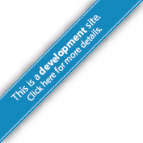
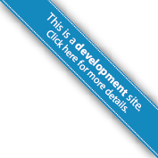

DAP Dev Ribbon 
===============

Ribbon for DAP development sites.

It should look like this: 


Usage 
-----

Just copy and paste one of the following snipped into the page's HTML: 

```html

<!-- Left hand-side ribbon. -->
<a href="#"></a>


<!-- Right hand-side ribbon. -->
<a href="#"></a>


```

Make sure to change the link to a to-be-created page that explains why the page visited is a development page and other details. The image link should also be updated to the DAP servers. 

Take a look at the `test.html` file file for a brief example. 


Credits
-------

Idea from GitHub https://github.com/blog/273-github-ribbons. 

DAP version created by Luis Capelo (capelo@un.org)
the original Illustrator file (CS5) (`DAP-Dev-Ribbon.ai`) is also incldued in the GitHub repo. 

